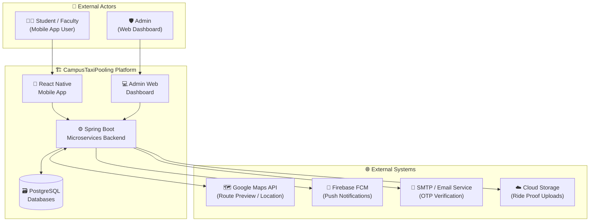
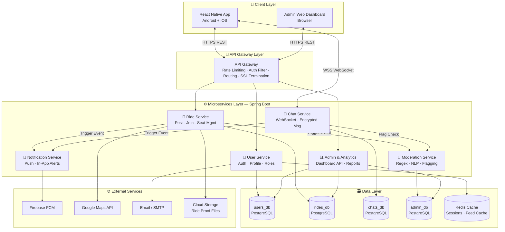
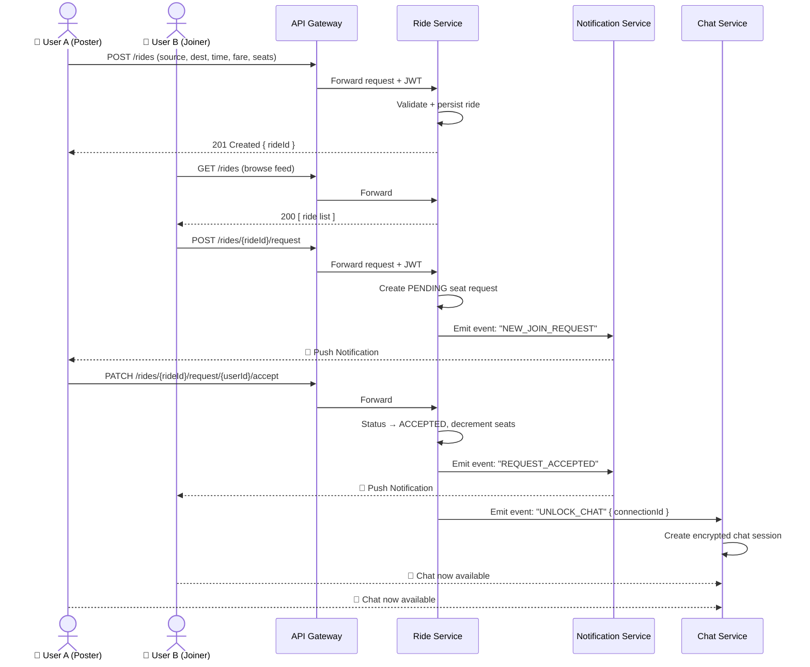
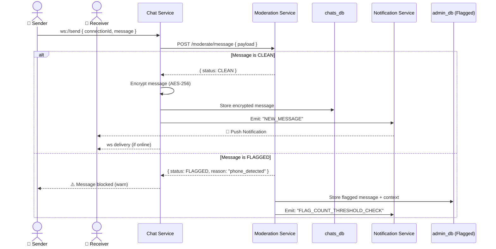
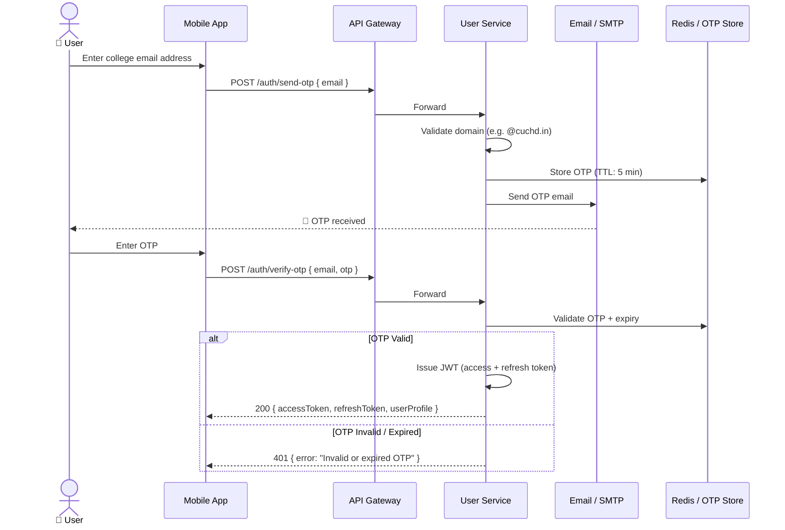
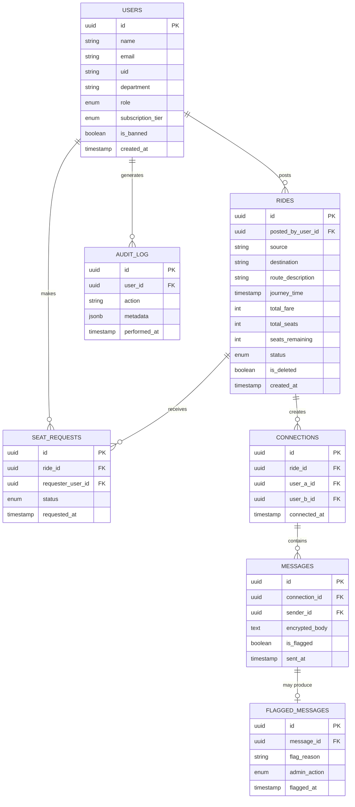
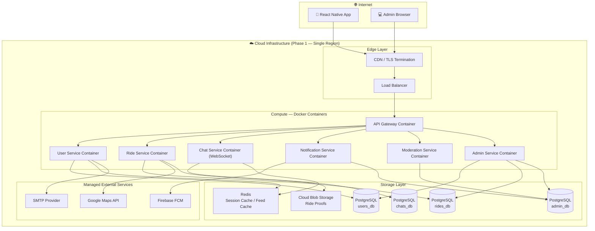

# CAMPUS TAXI POOLING — ARCHITECTURE DIAGRAMS

> **Document Type:** System Architecture Reference  
> **Scope:** High-Level Architecture + Low-Level Service Design  
> **Stack:** React Native · Spring Boot Microservices · PostgreSQL · WebSockets · Push Notifications  
> **Phase:** Pre-Development Analysis → System Design Phase

---

## DIAGRAM 1 — SYSTEM CONTEXT DIAGRAM (Bird's Eye View)

> Who are the actors and what external systems touch our platform?

---

## DIAGRAM 2 — HIGH-LEVEL ARCHITECTURE DIAGRAM

> How are the major system layers connected?

---

## DIAGRAM 3 — LOW-LEVEL ARCHITECTURE DIAGRAM

> Internal design of each microservice and the data they own

```mermaid
graph LR
    subgraph US_BOX["👤 USER SERVICE"]
        direction TB
        UA["AuthController\nPOST /auth/send-otp\nPOST /auth/verify-otp"]
        UB["ProfileController\nGET /users/me\nPUT /users/me\nGET /users/:id"]
        UC["UserRepository\n→ users table"]
        UD[("users_db\nusers\notp_tokens\nsubscriptions\naudit_log")]
        UA --> UC --> UD
        UB --> UC
    end

    subgraph RS_BOX["🚗 RIDE SERVICE"]
        direction TB
        RA["RideController\nPOST /rides\nGET /rides\nPATCH /rides/:id\nDELETE /rides/:id"]
        RB["ConnectionController\nPOST /rides/:id/request\nPATCH /rides/:id/request/:uid/accept\nGET /rides/:id/passengers"]
        RC["RideRepository\n→ rides table"]
        RD["ConnectionRepository\n→ connections table"]
        RE[("rides_db\nrides\nseat_requests\nconnections\nride_proof_files")]
        RA --> RC --> RE
        RB --> RD --> RE
    end

    subgraph CS_BOX["💬 CHAT SERVICE"]
        direction TB
        CA["WebSocket Handler\nws://connect\nws://send\nws://disconnect"]
        CB["MessageController\nGET /chats/:connectionId/history"]
        CC["MessageRepository\n→ messages table"]
        CD["EncryptionLayer\nAES-256 per connection"]
        CE[("chats_db\nmessages\nchat_sessions")]
        CA --> CD --> CC --> CE
        CB --> CC
    end

    subgraph MS_BOX["🤖 MODERATION SERVICE"]
        direction TB
        MA["ModerationController\nPOST /moderate/message\nGET /moderate/flagged"]
        MB["RegexEngine\nPhone · Email detection"]
        MC["KeywordFilter\n'call me' · 'WhatsApp' etc"]
        MD["NLP Engine\nLightweight classification"]
        ME[("admin_db\nflagged_messages\nmoderation_log")]
        MA --> MB --> ME
        MA --> MC --> ME
        MA --> MD --> ME
    end

    subgraph NS_BOX["🔔 NOTIFICATION SERVICE"]
        direction TB
        NA["NotificationController\nPOST /notify/push\nGET /notify/history/:uid"]
        NB["FCMAdapter\nFirebase Push"]
        NC["InAppAdapter\nIn-app alert storage"]
        ND[("admin_db\nnotifications")]
        NA --> NB
        NA --> NC --> ND
    end

    subgraph AS_BOX["📊 ADMIN & ANALYTICS SERVICE"]
        direction TB
        AA["AdminController\nGET /admin/users\nPATCH /admin/users/:id/ban\nGET /admin/rides\nGET /admin/reports\nGET /admin/flagged"]
        AB["AnalyticsController\nGET /analytics/dashboard\nGET /analytics/export"]
        AC[("Read access:\nusers_db\nrides_db\nadmin_db")]
        AA --> AC
        AB --> AC
    end
```

---

## DIAGRAM 4 — RIDE WORKFLOW (Sequence Diagram)

> Step-by-step flow from ride post to confirmed connection

---

## DIAGRAM 5 — CHAT + MODERATION WORKFLOW (Sequence Diagram)

> How a message travels through the safety layer before delivery

---

## DIAGRAM 6 — AUTHENTICATION FLOW (Sequence Diagram)

> OTP-based email verification and JWT issuance

---

## DIAGRAM 7 — DATA MODEL OVERVIEW (Entity Relationship)

> Core entities and their relationships across services

---

## DIAGRAM 8 — DEPLOYMENT TOPOLOGY

> How services map to infrastructure in Phase 1

---

## SUMMARY TABLE

| Service | Owns DB | Protocol | External Dep | Triggers |
|---|---|---|---|---|
| User Service | `users_db` | REST | SMTP | — |
| Ride Service | `rides_db` | REST | Google Maps, Cloud Storage | Notification, Chat |
| Chat Service | `chats_db` | WebSocket + REST | — | Moderation, Notification |
| Moderation Service | `admin_db` | REST (internal) | — | Admin review, NS threshold |
| Notification Service | `admin_db` | REST (internal) | Firebase FCM | — |
| Admin & Analytics | Read-all DBs | REST | — | — |

---

> **Author:** Architecture Analysis Phase  
> **Date:** 2026-03-22  
> **Status:** Ready for DB Schema + API Contract population
